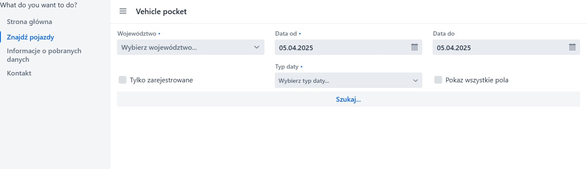
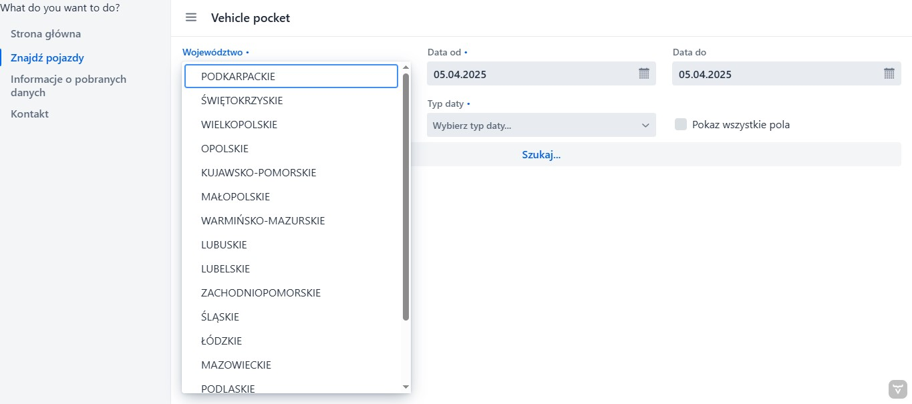
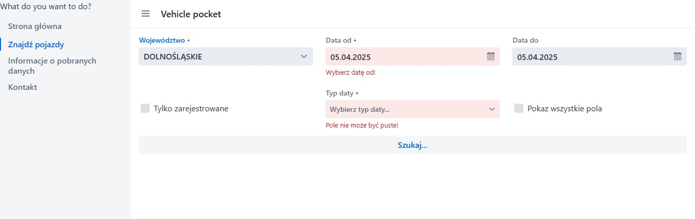
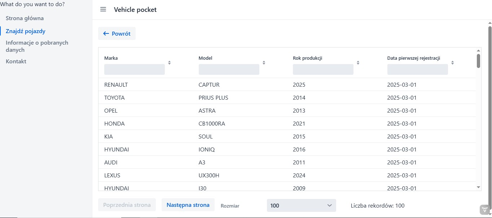
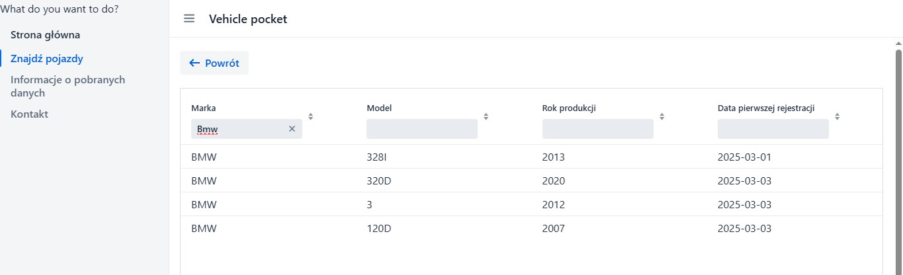
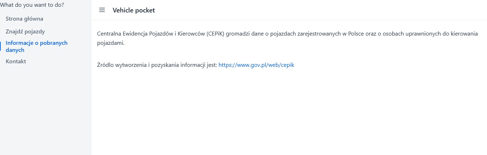
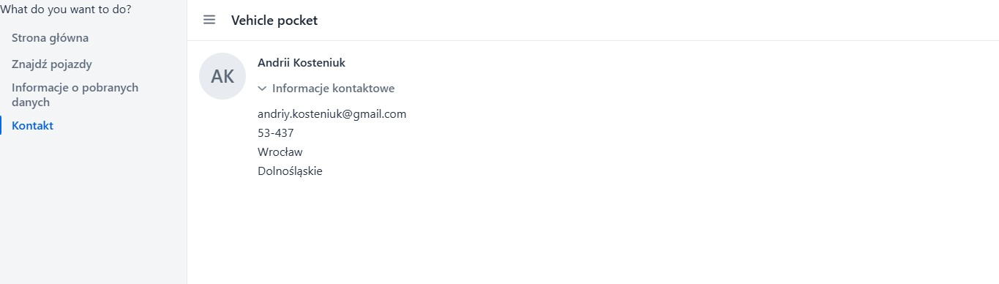

# CEPIK Vehicle Lookup App

A web-based application built using 
**Spring Framework** and 
**Vaadin** that allows users 
to fetch and view information about 
vehicles registered in Poland, 
using data from the CEPIK API.


## 📜 Table of Contents

* [Features](#-features)
* [Prerequisites](#prerequisites)
* [Steps](#steps)
* [Technologies used](#-technologies-used)
* [Examples](#-examples)

## ✨ Features

- Search for vehicles registered in Poland via CEPIK API
- Display vehicle information in a clean and interactive UI
- Responsive design using Vaadin
- Structured error handling and logging

## Prerequisites
- Java 17+
- Maven
- Internet access for CEPIK API calls

## Steps

Clone the Repository

```
git clone https://github.com/Andrii-Kosteniuk/Rest-Client-App
```

Run the Application

```bash
mvn clean install
```
```bash
mvn spring-boot:run
```

The application will start on http://localhost:8080

## 🛠 Technologies Used

- Spring Framework (Spring Boot, RestClient)
- Vaadin framework 
- Jackson
- Logging (SLF4J)

## 📸 Examples

1.Home page


2.Search vehicle page


3.Chose a province


4.Chose a date from and type of returned date


5.Retrieved data from central API Cepik


6.Filtering data


7.Information about data


9.My contact


